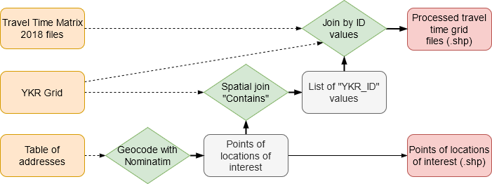

## University of Helsinki QMSLUP course group work of Group 9:   A python tool to take a .csv table of Helsinki metropolitan region addresses, and output their locations' accessibility data as preprocessed grid shapefiles.

### The tool automates preprocessing steps often done manually through a GIS software GUI, saving time especially when analysing multiple locations.

**Typical preprocessing steps this tool automates:**

1. Finding which YKR Grid square your locations of interest are in

2. Joining the appropriate Travel Time Matrix (TTM) data for each location to a copy of the YKR grid

3. Saving the resulting joined layer

**Doing these tasks manually might take a minute per location, whereas when this tool is set up, each additional location adds only about 7.5 seconds of processing time. This means 20 locations processed in 3-4 minutes instead of 20!**

### Tool workflow:

-----
 

# Notes

## Required data downloads

YKR Grid data and Helsinki Travel Time Matrix data are needed: DL links available [here](https://blogs.helsinki.fi/saavutettavuus/paakaupunkiseudun-matka-aikamatriisi-2018/)

## Inputs

1. File paths to YKR Grid and Travel Time Matrix data

2. A .csv file of addresses for the locations to be analysed

## Outputs

1. A grid of travel times from the input locations

2. Optionally the geocoded points of the input addresses

## Other

1. Edit filepaths at the beginning of main.py to your own filepaths

2. Addresses in the .csv file need to be in a column named 'addr'

3. Tested by installing the required packages in an Anaconda command prompt using: 'conda install --file Requirements.txt'

4. The address file used in our analysis is included as 'libraries.txt' in the 'data' folder, which is also the default output folder
